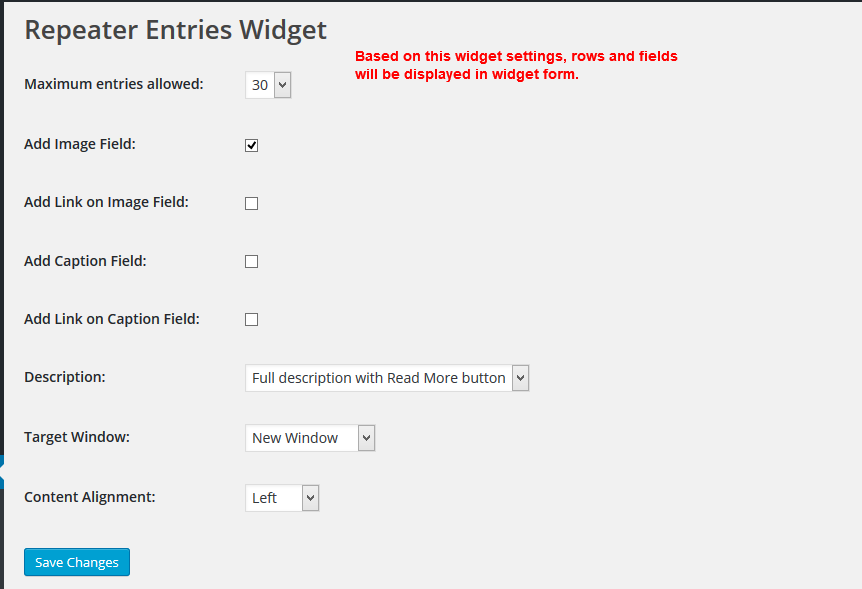
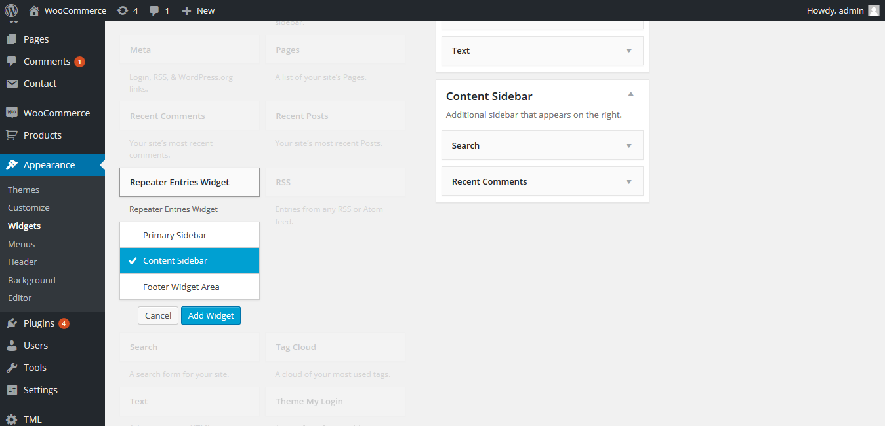
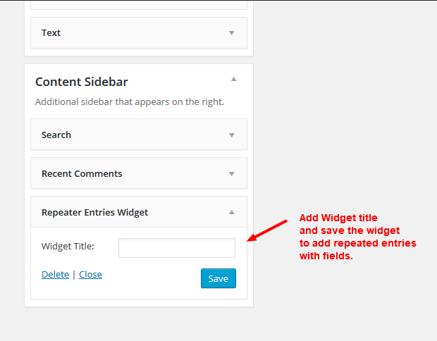
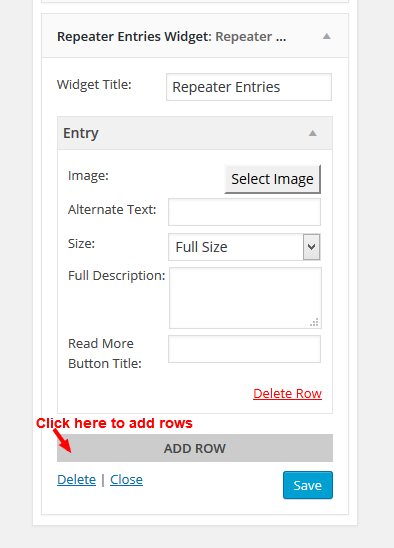
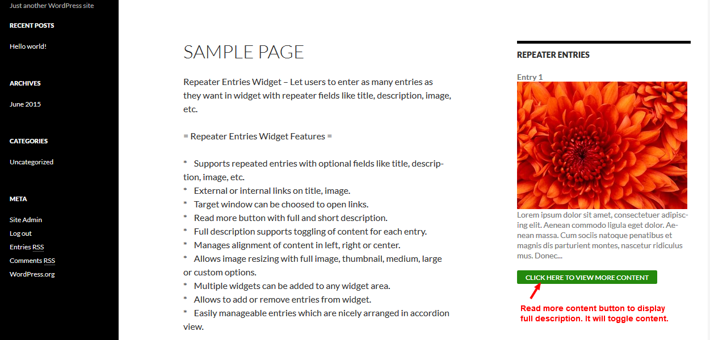
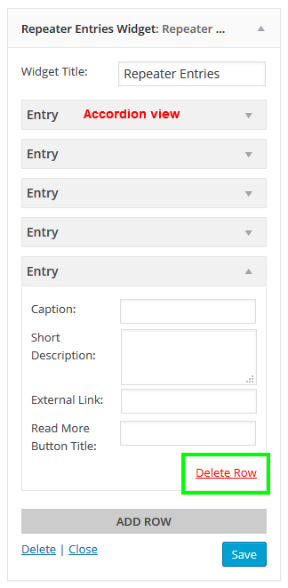
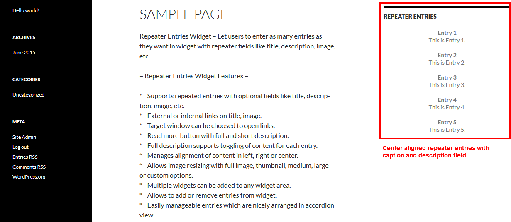

# Repeater Entries Widget
Repeater Entries Widget – Let users to enter as many entries as they want in widget with repeater fields like caption, description, image, etc.

# Installation
1. Download the plugin zip file from WordPress.org plugin site to your desktop / PC
2. If the file is downloaded as a zip archive, extract the plugin folder to your desktop.
3. With your FTP program, upload the plugin folder to the wp-content/plugins folder in your WordPress directory online
4. Go to the Plugin screen and find the newly uploaded Plugin in the list.
5. Click ‘Activate Plugin’ to activate it.

# How To Use

shows all the possible options available for this widget at Settings -> Repeater Widget Entries.

shows Repeater Entries Widget at Appearance -> Widgets.

shows admin side view of Repeater Entries Widget before saving widget title.

shows admin side view of Repeater Entries Widget after saving widget title with "Add Row" button.

shows frontend view with caption, image, full description with Read More button to toggle content.

shows admin side view of repeated entries in accordion view and "Delete Row" link.

shows frontend view of repeated entries in with caption and short description field in center alignment.

# Getting Help

If you have any difficulties while using this Plugin, please feel free to contact us at opensource@zealousweb.com. We also offer custom WordPress extension development and WordPress theme design services to fulfill your e-commerce objectives. Our professional dy‐ namic WordPress experts provide profound and customer-oriented development of your project within short timeframes. Thank you for choosing a Plugin developed by ZealousWeb!
